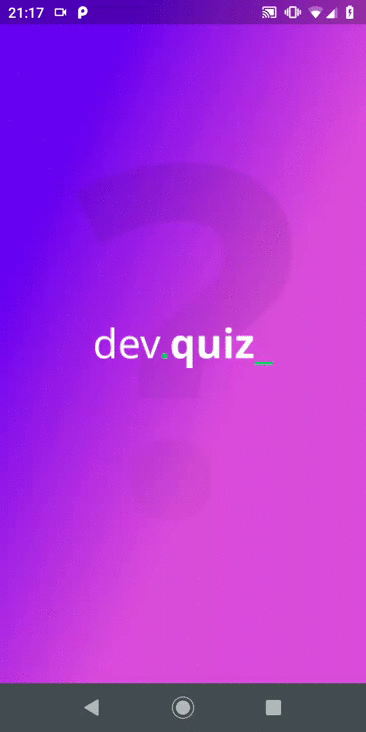

<p align="center">
      
</p>

<h1 align="center">DevQuiz</h1>

<h2 align="center">Tópicos 📋</h2>

   <p>
   
   - [Sobre 📖](#sobre-)
   - [Preview 📱](#preview-)
   - [Layout 🎨](#layout-)
   - [Funcionalidades 🛠️](#Funcionalidades-%EF%B8%8F)
   - [Como Rodar 🤔](#como-usar-)
   - [Como Contribuir 💪](#como-contribuir-)
   - [Licença 📝](#licença-)

   </p>

---

<h2 align="center">Sobre 📖</h2>
   
<p align="center">
   O QuizDev foi desenvolvido na Next Level Week, uma semana intensa de estudos, em flutter  desenvolvido pela Rocketseat. <br>
   Essa aplicação tem como intuito ser um Quiz para programadores intensificarem seu conhecimento em programação flutter, através dos exercícios propostos pela aplicação, onde você tem a interatividade de perguntas e respostas.<br>
</p>

---

<h2 align="center">Preview 📱</h2>

   <p align="center">
      
   </p>

---

<h2 align="center">Layout 🎨</h2>

   <p align="center">
      O Layout pode acessá-lo no Figma:
   - <a href="https://www.figma.com/file/3nryFKRuOa3nUSsXDUzcDn/DevQuiz-(Copy)?node-id=0%3A11">Mobile</a> 📱
   </p>
---

<h2 align="center">Funcionalidades 🛠️</h2>

   <p>   
Quiz 
    - Perguntas,
    - Respostas,
    - Feedback para o usuário,
    - Ranking e Score, 
    - Resultados
    - Compartilhamento de Resultados...
- Entre várias outras coisas incríveis!
   </p>

---

<h2 align="center">Como Rodar 🤔</h2>

   ```
   Antes de tudo, configure corretamente o ambiente de desenvolvimento Flutter em sua máquina, 
   see https://flutter.dev/docs/get-started/install
   
   - Clonar este repositório:
   $ git clonehttps://github.com/LarisseLima/dev-quiz 

   - Entre no diretório:
   $ cd Dev-Quiz

   - Para instalar as dependências:
   $ flutter pub get

   - Rodar o  app: 
   $ flutter run
   ```
---

<h2 align="center">Como Contribuir 💪</h2>

   ```
   - Fork o projeto 

   - Cria uma nova branch com suas mudanças:
   $ git checkout -b my-feature

   - Salve suas mudanças e crie uma mensagem de commit falando o que fez:
   $ git commit -m "feature: My new feature"

   - Envie suas mudanças:
   $ git push origin my-feature
   ```
---

<h2 align="center">Licença 📝</h2>

<p align="center">
   Este repositório está sob licença MIT.Você pode ver o arquivo <a href="https://github.com/LarisseLima/dev-quiz/new/master">LICENSE</a> para mais detalhes. 😉
</p>
   ---
   >Esse projeto foi desenvolvido com ❤️ por **[@Larisse Lima](https://www.linkedin.com/in/larisselima/)**, na #NextLevelWeek05 da **[Rocketseat](https://rocketseat.com.br/)**.<br>
---
